# doc-ver


## C4 Model


## Usage

### Prerequisites
To install helm and setup your local environment, please follow the instructions [here](docs/environment-setup.md).

### Installing the Chart
This helm chart is published in microblinks helm chart repository - `https://helm.microblink.com/charts`.

To use it, simply add the repository to your helm client:
```bash
helm repo add microblink https://helm.microblink.com/charts
helm repo update
```

Then you can install the chart using:
```bash
helm install my-release -f <path to values file you want to use to configure the chart> microblink/doc-ver
```
## Requirements

| Repository | Name | Version |
|------------|------|---------|
| https://charts.bitnami.com/bitnami | postgresql | 13.2.27 |
| https://helm.microblink.com/charts | anomdet-intermediary | 0.1.1 |
| https://helm.microblink.com/charts | bundle-visual-anomaly-core-versions | 0.9.2 |
| https://helm.microblink.com/charts | doc-ver-api | 0.0.14 |
| https://helm.microblink.com/charts | docver-runner | 0.0.2 |
| https://helm.microblink.com/charts | embedding-store | 0.26.0 |
| https://helm.microblink.com/charts | mlp-local-storage | 2.1.0 |
| https://helm.microblink.com/charts | bundle-doc-ver-core-versions(model-serving) | 1.4.2 |
| https://helm.microblink.com/charts | visual-anomaly | 0.0.11 |

## Values

| Key | Type | Default | Description |
|-----|------|---------|-------------|
| anomdet-intermediary.affinity | object | `{}` | deployment affinity |
| anomdet-intermediary.anomdetIntermediaryConfig | object | `{"collection-name":"mdv-2005","model-id":"6687ad3b04248f708c1e0c95","model-name":"visual-anomaly","parallel-queries":10000}` | do not update anomdetIntermediaryConfig values, they are fixed for a specific docver release |
| anomdet-intermediary.anomdetIntermediaryConfig.parallel-queries | int | `10000` | without blocking the requests in a sequence |
| anomdet-intermediary.autoscaling.enabled | bool | `false` | if enabled, deployment will be autoscaled |
| anomdet-intermediary.autoscaling.maxReplicas | int | `2` | max replicas hpa will scale up to |
| anomdet-intermediary.autoscaling.minReplicas | int | `1` | min replicas hpa will scale down to |
| anomdet-intermediary.autoscaling.targetCPUUtilizationPercentage | int | `80` | if set, hpa will scale based on cpu usage, target cpu usage percentage |
| anomdet-intermediary.autoscaling.targetMemoryUtilizationPercentage | int | `80` | if set, hpa will scale based on memory usage, target memory usage percentage |
| anomdet-intermediary.containerSecurityContext | object | `{}` | container security context |
| anomdet-intermediary.enabled | bool | `false` | enable anomdet-intermediary component |
| anomdet-intermediary.image.repository | string | `"us-central1-docker.pkg.dev/document-verification-public/docver-gcm/anomaly-detection-intermediary/onprem"` |  |
| anomdet-intermediary.ingress.enabled | bool | `false` |  |
| anomdet-intermediary.nodeSelector | object | `{}` | deployment node selector |
| anomdet-intermediary.podSecurityContext | object | `{}` | pod security context |
| anomdet-intermediary.replicaCount | int | `1` |  |
| anomdet-intermediary.resources.limits.cpu | int | `1` | deployment resource cpu limit |
| anomdet-intermediary.resources.limits.memory | string | `"1Gi"` | deployment resource memory limit |
| anomdet-intermediary.resources.requests.cpu | string | `"300m"` | deployment resource cpu requests |
| anomdet-intermediary.resources.requests.memory | string | `"512Mi"` | deployment resource memory requests |
| anomdet-intermediary.tolerations | list | `[]` | deployment tolerations |
| auth.dbCreds.createSecret | bool | `true` | if you do not expect multiple database users and db will not be exposed to any external traffic, set this to true and it will create secret used by both embedding-store and postgresql (if postgresql is deployed as part of this helm release) |
| auth.dbCreds.password | string | `"x9xv1mw0td"` | if createSecret is set to true, set the database password here, we don't expect to have external traffic to the database, so we can use fixed password. If you want to manage user credentials password outside of this helm release simply create a secret with the name you specified under secretName, and disable createSecret. Contents of this secret are just two fields `EMBEDDING_STORE_PGVECTOR_USERNAME` and `EMBEDDING_STORE_PGVECTOR_PASSWORD` - first holding the username and second holding the password of the database user you want our service to use. Check out the templates/db-creds.yaml for more details on the content of the secret |
| auth.dbCreds.secretName | string | `"mb-docver-db-creds"` | name of the secret, this string value must be updated in both postgresql and embedding-store |
| auth.dbCreds.username | string | `"embedding-store-sa"` | if createSecret is set to true, set the database username here, if you update this value, make sure to update the value in the postgresql section as well (if postgresql is enabled). if you are using "external db" like cloud SQL or RDS, set this to the username you have created in the database |
| auth.license.applicationId | string | `""` | App identifier from microblink developer hub |
| auth.license.createSecret | bool | `false` | enable if you want to create license secret as part of this charts deployment |
| auth.license.licenseKey | string | `""` | if createSecret is set to true, set the license key here |
| auth.license.secretName | string | `"license-key"` | name of license-key secret, if changed, it must be updated in doc-ver-api |
| bundle-doc-ver-core-versions.bundle.models.affinity | object | `{}` |  |
| bundle-doc-ver-core-versions.bundle.models.autoscaling.enabled | bool | `true` |  |
| bundle-doc-ver-core-versions.bundle.models.autoscaling.initialScale | int | `1` |  |
| bundle-doc-ver-core-versions.bundle.models.autoscaling.maxReplicas | int | `2` |  |
| bundle-doc-ver-core-versions.bundle.models.autoscaling.minReplicas | int | `1` |  |
| bundle-doc-ver-core-versions.bundle.models.autoscaling.scaleDownDelay | string | `"5m"` |  |
| bundle-doc-ver-core-versions.bundle.models.autoscaling.scaleStableWindow | string | `"60s"` |  |
| bundle-doc-ver-core-versions.bundle.models.autoscaling.targetCPUUtilizationPercentage | string | `"80"` |  |
| bundle-doc-ver-core-versions.bundle.models.autoscaling.targetConcurrency | string | `""` |  |
| bundle-doc-ver-core-versions.bundle.models.autoscaling.targetMemoryUtilizationPercentage | string | `""` |  |
| bundle-doc-ver-core-versions.bundle.models.autoscaling.targetRPS | string | `""` |  |
| bundle-doc-ver-core-versions.bundle.models.autoscaling.type | string | `"hpa"` |  |
| bundle-doc-ver-core-versions.bundle.models.containerSecurityContext | object | `{}` |  |
| bundle-doc-ver-core-versions.bundle.models.engine.batching.batch_timeout_micros | string | `""` |  |
| bundle-doc-ver-core-versions.bundle.models.engine.batching.enabled | bool | `false` |  |
| bundle-doc-ver-core-versions.bundle.models.engine.batching.max_batch_size | string | `""` |  |
| bundle-doc-ver-core-versions.bundle.models.engine.batching.max_enqueued_batches | string | `""` |  |
| bundle-doc-ver-core-versions.bundle.models.engine.batching.num_batch_threads | string | `""` |  |
| bundle-doc-ver-core-versions.bundle.models.engine.batching.pad_variable_length_inputs | bool | `false` |  |
| bundle-doc-ver-core-versions.bundle.models.engine.grpc_max_threads | int | `0` |  |
| bundle-doc-ver-core-versions.bundle.models.engine.monitoring.enabled | bool | `false` |  |
| bundle-doc-ver-core-versions.bundle.models.engine.parallelization.enabled | bool | `true` |  |
| bundle-doc-ver-core-versions.bundle.models.engine.parallelization.inter_op | int | `0` |  |
| bundle-doc-ver-core-versions.bundle.models.engine.parallelization.intra_op | int | `0` |  |
| bundle-doc-ver-core-versions.bundle.models.engine.type | string | `"tfServing"` |  |
| bundle-doc-ver-core-versions.bundle.models.engine.warmStart | bool | `false` |  |
| bundle-doc-ver-core-versions.bundle.models.env | object | `{}` |  |
| bundle-doc-ver-core-versions.bundle.models.image.pullPolicy | string | `"IfNotPresent"` |  |
| bundle-doc-ver-core-versions.bundle.models.image.repository | string | `"us-central1-docker.pkg.dev/document-verification-public/docver-gcm/tf-serving-kira-native-cpu/onprem"` |  |
| bundle-doc-ver-core-versions.bundle.models.image.tag | string | `"v2.13.0-3.11.3"` |  |
| bundle-doc-ver-core-versions.bundle.models.initContainerSecurityContext | object | `{}` |  |
| bundle-doc-ver-core-versions.bundle.models.labels | object | `{}` |  |
| bundle-doc-ver-core-versions.bundle.models.liveness.initialDelaySeconds | int | `30` |  |
| bundle-doc-ver-core-versions.bundle.models.liveness.periodSeconds | int | `30` |  |
| bundle-doc-ver-core-versions.bundle.models.maxLimits.cpu | string | `"3"` |  |
| bundle-doc-ver-core-versions.bundle.models.maxLimits.gpu | string | `""` |  |
| bundle-doc-ver-core-versions.bundle.models.maxLimits.memory | string | `"2Gi"` |  |
| bundle-doc-ver-core-versions.bundle.models.minLimits.cpu | string | `"3"` |  |
| bundle-doc-ver-core-versions.bundle.models.minLimits.gpu | string | `""` |  |
| bundle-doc-ver-core-versions.bundle.models.minLimits.memory | string | `"2Gi"` |  |
| bundle-doc-ver-core-versions.bundle.models.model.globalStorage.bucket | string | `"identity-enc-models-public"` |  |
| bundle-doc-ver-core-versions.bundle.models.model.globalStorage.isPublic | bool | `true` |  |
| bundle-doc-ver-core-versions.bundle.models.model.globalStorage.type | string | `"gs"` |  |
| bundle-doc-ver-core-versions.bundle.models.model.storage.bucket | string | `"identity-enc-models-public"` |  |
| bundle-doc-ver-core-versions.bundle.models.model.storage.isPublic | bool | `true` |  |
| bundle-doc-ver-core-versions.bundle.models.model.storage.type | string | `"gs"` |  |
| bundle-doc-ver-core-versions.bundle.models.nodeSelector | object | `{}` |  |
| bundle-doc-ver-core-versions.bundle.models.podAnnotations | object | `{}` |  |
| bundle-doc-ver-core-versions.bundle.models.podSecurityContext | object | `{}` |  |
| bundle-doc-ver-core-versions.bundle.models.readiness | object | `{}` |  |
| bundle-doc-ver-core-versions.bundle.models.replicaCount | string | `""` |  |
| bundle-doc-ver-core-versions.bundle.models.startup.failureThreshold | int | `30` |  |
| bundle-doc-ver-core-versions.bundle.models.startup.periodSeconds | int | `16` |  |
| bundle-doc-ver-core-versions.bundle.models.tolerations | list | `[]` |  |
| bundle-doc-ver-core-versions.bundle.proxy.affinity | object | `{}` |  |
| bundle-doc-ver-core-versions.bundle.proxy.args.printfServiceNameFormat | string | `""` |  |
| bundle-doc-ver-core-versions.bundle.proxy.autoscaling.enabled | bool | `false` |  |
| bundle-doc-ver-core-versions.bundle.proxy.autoscaling.maxReplicas | int | `0` |  |
| bundle-doc-ver-core-versions.bundle.proxy.autoscaling.minReplicas | int | `0` |  |
| bundle-doc-ver-core-versions.bundle.proxy.autoscaling.targetCPUUtilizationPercentage | string | `""` |  |
| bundle-doc-ver-core-versions.bundle.proxy.autoscaling.targetMemoryUtilizationPercentage | string | `""` |  |
| bundle-doc-ver-core-versions.bundle.proxy.containerSecurityContext | object | `{}` |  |
| bundle-doc-ver-core-versions.bundle.proxy.env | object | `{}` |  |
| bundle-doc-ver-core-versions.bundle.proxy.image.pullPolicy | string | `"IfNotPresent"` |  |
| bundle-doc-ver-core-versions.bundle.proxy.image.repository | string | `"us-central1-docker.pkg.dev/document-verification-public/docver-gcm/mlp-model-proxy/onprem"` |  |
| bundle-doc-ver-core-versions.bundle.proxy.image.tag | string | `"v0.20.0"` |  |
| bundle-doc-ver-core-versions.bundle.proxy.ingress.className | string | `"nginx"` |  |
| bundle-doc-ver-core-versions.bundle.proxy.ingress.enabled | bool | `false` |  |
| bundle-doc-ver-core-versions.bundle.proxy.ingress.host | string | `""` |  |
| bundle-doc-ver-core-versions.bundle.proxy.ingress.ssl.enabled | bool | `true` |  |
| bundle-doc-ver-core-versions.bundle.proxy.ingress.ssl.force | bool | `false` |  |
| bundle-doc-ver-core-versions.bundle.proxy.ingress.ssl.redirect | bool | `true` |  |
| bundle-doc-ver-core-versions.bundle.proxy.ingress.tls.enabled | bool | `false` |  |
| bundle-doc-ver-core-versions.bundle.proxy.labels | object | `{}` |  |
| bundle-doc-ver-core-versions.bundle.proxy.liveness.initialDelaySeconds | int | `15` |  |
| bundle-doc-ver-core-versions.bundle.proxy.liveness.periodSeconds | int | `15` |  |
| bundle-doc-ver-core-versions.bundle.proxy.maxLimits.cpu | string | `"2"` |  |
| bundle-doc-ver-core-versions.bundle.proxy.maxLimits.memory | string | `"2Gi"` |  |
| bundle-doc-ver-core-versions.bundle.proxy.minLimits.cpu | string | `"1"` |  |
| bundle-doc-ver-core-versions.bundle.proxy.minLimits.memory | string | `"1Gi"` |  |
| bundle-doc-ver-core-versions.bundle.proxy.nodeSelector | object | `{}` |  |
| bundle-doc-ver-core-versions.bundle.proxy.podAnnotations | object | `{}` |  |
| bundle-doc-ver-core-versions.bundle.proxy.podSecurityContext | object | `{}` |  |
| bundle-doc-ver-core-versions.bundle.proxy.readiness.initialDelaySeconds | int | `15` |  |
| bundle-doc-ver-core-versions.bundle.proxy.readiness.periodSeconds | int | `15` |  |
| bundle-doc-ver-core-versions.bundle.proxy.replicaCount | string | `""` |  |
| bundle-doc-ver-core-versions.bundle.proxy.service.grpcPort | string | `"8005"` |  |
| bundle-doc-ver-core-versions.bundle.proxy.service.httpPort | string | `"8000"` |  |
| bundle-doc-ver-core-versions.bundle.proxy.service.type | string | `"ClusterIP"` |  |
| bundle-doc-ver-core-versions.bundle.proxy.signatures.modelDefinitions.photo-fraud-classifier-intl.backendInferenceEngine | string | `"tfServing"` |  |
| bundle-doc-ver-core-versions.bundle.proxy.signatures.modelDefinitions.photo-fraud-classifier-intl.models[0].id | string | `"67e56611a7b8d3605d024303"` |  |
| bundle-doc-ver-core-versions.bundle.proxy.signatures.modelDefinitions.photo-fraud-classifier-intl.models[0].signatureId | string | `"photo-fraud-classifier-signature"` |  |
| bundle-doc-ver-core-versions.bundle.proxy.signatures.modelDefinitions.photo-fraud-classifier.backendInferenceEngine | string | `"tfServing"` |  |
| bundle-doc-ver-core-versions.bundle.proxy.signatures.modelDefinitions.photo-fraud-classifier.models[0].id | string | `"679bb8eca6b919056c62a425"` |  |
| bundle-doc-ver-core-versions.bundle.proxy.signatures.modelDefinitions.photo-fraud-classifier.models[0].signatureId | string | `"photo-fraud-classifier-signature"` |  |
| bundle-doc-ver-core-versions.bundle.proxy.signatures.modelDefinitions.photocopy-classifier-contextual-unified.backendInferenceEngine | string | `"tfServing"` |  |
| bundle-doc-ver-core-versions.bundle.proxy.signatures.modelDefinitions.photocopy-classifier-contextual-unified.models[0].id | string | `"66e2b36788703787163f0ecf"` |  |
| bundle-doc-ver-core-versions.bundle.proxy.signatures.modelDefinitions.photocopy-classifier-contextual-unified.models[0].signatureId | string | `"photocopy-classifier-contextual-unified-signature"` |  |
| bundle-doc-ver-core-versions.bundle.proxy.signatures.signatureDefinitions.photo-fraud-classifier-signature.inputs[0].params.imageInputKey | string | `"image_input"` |  |
| bundle-doc-ver-core-versions.bundle.proxy.signatures.signatureDefinitions.photo-fraud-classifier-signature.inputs[0].typeId | string | `"Image"` |  |
| bundle-doc-ver-core-versions.bundle.proxy.signatures.signatureDefinitions.photo-fraud-classifier-signature.outputs[0].params.classNameOutput | string | `"label"` |  |
| bundle-doc-ver-core-versions.bundle.proxy.signatures.signatureDefinitions.photo-fraud-classifier-signature.outputs[0].params.scoreOutput | string | `"probability"` |  |
| bundle-doc-ver-core-versions.bundle.proxy.signatures.signatureDefinitions.photo-fraud-classifier-signature.outputs[0].typeId | string | `"MaxClassification"` |  |
| bundle-doc-ver-core-versions.bundle.proxy.signatures.signatureDefinitions.photocopy-classifier-contextual-unified-signature.inputs[0].name | string | `"image_input"` |  |
| bundle-doc-ver-core-versions.bundle.proxy.signatures.signatureDefinitions.photocopy-classifier-contextual-unified-signature.inputs[0].params.imageInputKey | string | `"image_input"` |  |
| bundle-doc-ver-core-versions.bundle.proxy.signatures.signatureDefinitions.photocopy-classifier-contextual-unified-signature.inputs[0].typeId | string | `"Image"` |  |
| bundle-doc-ver-core-versions.bundle.proxy.signatures.signatureDefinitions.photocopy-classifier-contextual-unified-signature.inputs[1].name | string | `"card_edges"` |  |
| bundle-doc-ver-core-versions.bundle.proxy.signatures.signatureDefinitions.photocopy-classifier-contextual-unified-signature.inputs[1].params.quadInputKey | string | `"card_edges"` |  |
| bundle-doc-ver-core-versions.bundle.proxy.signatures.signatureDefinitions.photocopy-classifier-contextual-unified-signature.inputs[1].typeId | string | `"Quad"` |  |
| bundle-doc-ver-core-versions.bundle.proxy.signatures.signatureDefinitions.photocopy-classifier-contextual-unified-signature.inputs[2].name | string | `"aspect_ratio"` |  |
| bundle-doc-ver-core-versions.bundle.proxy.signatures.signatureDefinitions.photocopy-classifier-contextual-unified-signature.inputs[2].params.scalarInputKey | string | `"aspect_ratio"` |  |
| bundle-doc-ver-core-versions.bundle.proxy.signatures.signatureDefinitions.photocopy-classifier-contextual-unified-signature.inputs[2].typeId | string | `"Scalar"` |  |
| bundle-doc-ver-core-versions.bundle.proxy.signatures.signatureDefinitions.photocopy-classifier-contextual-unified-signature.outputs[0].params.classNameOutput | string | `"label"` |  |
| bundle-doc-ver-core-versions.bundle.proxy.signatures.signatureDefinitions.photocopy-classifier-contextual-unified-signature.outputs[0].params.scoreOutput | string | `"probability"` |  |
| bundle-doc-ver-core-versions.bundle.proxy.signatures.signatureDefinitions.photocopy-classifier-contextual-unified-signature.outputs[0].typeId | string | `"MaxClassification"` |  |
| bundle-doc-ver-core-versions.bundle.proxy.tolerations | list | `[]` |  |
| bundle-doc-ver-core-versions.bundle.serving.downloadModels | bool | `false` |  |
| bundle-doc-ver-core-versions.bundle.serving.envoy.containerPort | string | `"8080"` |  |
| bundle-doc-ver-core-versions.bundle.serving.envoy.containerSecurityContext | object | `{}` |  |
| bundle-doc-ver-core-versions.bundle.serving.envoy.dnsConfig | object | `{}` |  |
| bundle-doc-ver-core-versions.bundle.serving.envoy.dnsPolicy | string | `""` |  |
| bundle-doc-ver-core-versions.bundle.serving.envoy.enabled | bool | `false` |  |
| bundle-doc-ver-core-versions.bundle.serving.envoy.liveness.initialDelaySeconds | int | `15` |  |
| bundle-doc-ver-core-versions.bundle.serving.envoy.liveness.periodSeconds | int | `15` |  |
| bundle-doc-ver-core-versions.bundle.serving.envoy.podSecurityContext | object | `{}` |  |
| bundle-doc-ver-core-versions.bundle.serving.envoy.port | string | `"80"` |  |
| bundle-doc-ver-core-versions.bundle.serving.envoy.replicaCount | int | `1` |  |
| bundle-doc-ver-core-versions.bundle.serving.nginx.containerPort | string | `"8080"` |  |
| bundle-doc-ver-core-versions.bundle.serving.nginx.containerSecurityContext | object | `{}` |  |
| bundle-doc-ver-core-versions.bundle.serving.nginx.dnsConfig | object | `{}` |  |
| bundle-doc-ver-core-versions.bundle.serving.nginx.dnsPolicy | string | `""` |  |
| bundle-doc-ver-core-versions.bundle.serving.nginx.enabled | bool | `true` |  |
| bundle-doc-ver-core-versions.bundle.serving.nginx.keepalive | string | `"320"` |  |
| bundle-doc-ver-core-versions.bundle.serving.nginx.keepaliveRequests | string | `"1000"` |  |
| bundle-doc-ver-core-versions.bundle.serving.nginx.liveness.initialDelaySeconds | int | `15` |  |
| bundle-doc-ver-core-versions.bundle.serving.nginx.liveness.periodSeconds | int | `15` |  |
| bundle-doc-ver-core-versions.bundle.serving.nginx.podSecurityContext | object | `{}` |  |
| bundle-doc-ver-core-versions.bundle.serving.nginx.port | string | `"80"` |  |
| bundle-doc-ver-core-versions.bundle.serving.nginx.replicaCount | int | `1` |  |
| bundle-doc-ver-core-versions.bundle.serving.nginx.resolver | string | `"kube-dns.kube-system.svc.cluster.local"` |  |
| bundle-doc-ver-core-versions.bundle.serving.nginx.timeout | string | `"600s"` |  |
| bundle-doc-ver-core-versions.bundle.serving.service.grpcPort | string | `"80"` |  |
| bundle-doc-ver-core-versions.bundle.serving.service.httpPort | string | `"8501"` |  |
| bundle-doc-ver-core-versions.bundle.serving.service.type | string | `"ClusterIP"` |  |
| bundle-doc-ver-core-versions.bundle.serving.syncJob.containerSecurityContext | object | `{}` |  |
| bundle-doc-ver-core-versions.bundle.serving.syncJob.podSecurityContext | object | `{}` |  |
| bundle-doc-ver-core-versions.enabled | bool | `true` | enable bundle-doc-ver-core-versions component |
| bundle-doc-ver-core-versions.fullnameOverride | string | `"bundle-doc-ver-core-versions"` |  |
| bundle-doc-ver-core-versions.models.66e2b36788703787163f0ecf.engine.parallelization.enabled | bool | `true` |  |
| bundle-doc-ver-core-versions.models.66e2b36788703787163f0ecf.engine.parallelization.inter_op | int | `2` |  |
| bundle-doc-ver-core-versions.models.66e2b36788703787163f0ecf.engine.parallelization.intra_op | int | `2` |  |
| bundle-doc-ver-core-versions.models.66e2b36788703787163f0ecf.engine.type | string | `"tfServing"` |  |
| bundle-doc-ver-core-versions.models.66e2b36788703787163f0ecf.env.OMP_NUM_THREADS | int | `2` |  |
| bundle-doc-ver-core-versions.models.66e2b36788703787163f0ecf.image.repository | string | `"us-central1-docker.pkg.dev/document-verification-public/docver-gcm/tf-serving-kira-native-cpu/onprem"` |  |
| bundle-doc-ver-core-versions.models.66e2b36788703787163f0ecf.image.tag | string | `"v2.13.0-3.11.3"` |  |
| bundle-doc-ver-core-versions.models.66e2b36788703787163f0ecf.maxLimits.cpu | int | `3` |  |
| bundle-doc-ver-core-versions.models.66e2b36788703787163f0ecf.maxLimits.memory | string | `"3Gi"` |  |
| bundle-doc-ver-core-versions.models.66e2b36788703787163f0ecf.minLimits.cpu | int | `2` |  |
| bundle-doc-ver-core-versions.models.66e2b36788703787163f0ecf.minLimits.memory | string | `"2Gi"` |  |
| bundle-doc-ver-core-versions.models.66e2b36788703787163f0ecf.model.project | string | `"doc-ver"` |  |
| bundle-doc-ver-core-versions.models.66e2b36788703787163f0ecf.model.repository | string | `"photocopy-classifier-contextual-unified"` |  |
| bundle-doc-ver-core-versions.models.66e2b36788703787163f0ecf.model.version | string | `"9.0.1"` |  |
| bundle-doc-ver-core-versions.models.679bb8eca6b919056c62a425.engine.parallelization.enabled | bool | `true` |  |
| bundle-doc-ver-core-versions.models.679bb8eca6b919056c62a425.engine.parallelization.inter_op | int | `1` |  |
| bundle-doc-ver-core-versions.models.679bb8eca6b919056c62a425.engine.parallelization.intra_op | int | `1` |  |
| bundle-doc-ver-core-versions.models.679bb8eca6b919056c62a425.engine.type | string | `"tfServing"` |  |
| bundle-doc-ver-core-versions.models.679bb8eca6b919056c62a425.env.OMP_NUM_THREADS | int | `1` |  |
| bundle-doc-ver-core-versions.models.679bb8eca6b919056c62a425.image.repository | string | `"us-central1-docker.pkg.dev/document-verification-public/docver-gcm/tf-serving-kira-native-cpu/onprem"` |  |
| bundle-doc-ver-core-versions.models.679bb8eca6b919056c62a425.image.tag | string | `"v2.13.0-3.12.0"` |  |
| bundle-doc-ver-core-versions.models.679bb8eca6b919056c62a425.maxLimits.cpu | int | `2` |  |
| bundle-doc-ver-core-versions.models.679bb8eca6b919056c62a425.maxLimits.memory | string | `"1Gi"` |  |
| bundle-doc-ver-core-versions.models.679bb8eca6b919056c62a425.minLimits.cpu | int | `1` |  |
| bundle-doc-ver-core-versions.models.679bb8eca6b919056c62a425.minLimits.memory | string | `"1Gi"` |  |
| bundle-doc-ver-core-versions.models.679bb8eca6b919056c62a425.model.project | string | `"doc-ver"` |  |
| bundle-doc-ver-core-versions.models.679bb8eca6b919056c62a425.model.repository | string | `"photo-fraud-classifier"` |  |
| bundle-doc-ver-core-versions.models.679bb8eca6b919056c62a425.model.version | string | `"8.3.0"` |  |
| bundle-doc-ver-core-versions.models.67e56611a7b8d3605d024303.engine.parallelization.enabled | bool | `true` |  |
| bundle-doc-ver-core-versions.models.67e56611a7b8d3605d024303.engine.parallelization.inter_op | int | `1` |  |
| bundle-doc-ver-core-versions.models.67e56611a7b8d3605d024303.engine.parallelization.intra_op | int | `1` |  |
| bundle-doc-ver-core-versions.models.67e56611a7b8d3605d024303.engine.type | string | `"tfServing"` |  |
| bundle-doc-ver-core-versions.models.67e56611a7b8d3605d024303.env.OMP_NUM_THREADS | int | `1` |  |
| bundle-doc-ver-core-versions.models.67e56611a7b8d3605d024303.image.repository | string | `"us-central1-docker.pkg.dev/document-verification-public/docver-gcm/tf-serving-kira-native-cpu/onprem"` |  |
| bundle-doc-ver-core-versions.models.67e56611a7b8d3605d024303.image.tag | string | `"v2.13.0-3.11.3"` |  |
| bundle-doc-ver-core-versions.models.67e56611a7b8d3605d024303.maxLimits.cpu | int | `2` |  |
| bundle-doc-ver-core-versions.models.67e56611a7b8d3605d024303.maxLimits.memory | string | `"1Gi"` |  |
| bundle-doc-ver-core-versions.models.67e56611a7b8d3605d024303.minLimits.cpu | int | `1` |  |
| bundle-doc-ver-core-versions.models.67e56611a7b8d3605d024303.minLimits.memory | string | `"1Gi"` |  |
| bundle-doc-ver-core-versions.models.67e56611a7b8d3605d024303.model.project | string | `"doc-ver"` |  |
| bundle-doc-ver-core-versions.models.67e56611a7b8d3605d024303.model.repository | string | `"photo-fraud-classifier-intl"` |  |
| bundle-doc-ver-core-versions.models.67e56611a7b8d3605d024303.model.version | string | `"1.0.0"` |  |
| bundle-visual-anomaly-core-versions.bundle.models.autoscaling.maxReplicas | int | `3` |  |
| bundle-visual-anomaly-core-versions.bundle.models.autoscaling.minReplicas | int | `1` |  |
| bundle-visual-anomaly-core-versions.bundle.models.autoscaling.type | string | `"hpa"` |  |
| bundle-visual-anomaly-core-versions.bundle.models.model.globalStorage.bucket | string | `"identity-enc-models-public"` |  |
| bundle-visual-anomaly-core-versions.bundle.models.model.globalStorage.isPublic | bool | `true` |  |
| bundle-visual-anomaly-core-versions.bundle.models.model.globalStorage.type | string | `"gs"` |  |
| bundle-visual-anomaly-core-versions.bundle.models.model.storage.bucket | string | `"identity-enc-models-public"` |  |
| bundle-visual-anomaly-core-versions.bundle.models.model.storage.isPublic | bool | `true` |  |
| bundle-visual-anomaly-core-versions.bundle.models.model.storage.type | string | `"gs"` |  |
| bundle-visual-anomaly-core-versions.bundle.proxy.autoscaling.enabled | bool | `true` |  |
| bundle-visual-anomaly-core-versions.bundle.proxy.autoscaling.maxReplicas | int | `3` |  |
| bundle-visual-anomaly-core-versions.bundle.proxy.autoscaling.minReplicas | int | `1` |  |
| bundle-visual-anomaly-core-versions.bundle.proxy.autoscaling.targetCPUUtilizationPercentage | string | `"80"` |  |
| bundle-visual-anomaly-core-versions.bundle.proxy.containerSecurityContext | object | `{}` | container security context |
| bundle-visual-anomaly-core-versions.bundle.proxy.env.GOGC | string | `"50"` |  |
| bundle-visual-anomaly-core-versions.bundle.proxy.image.repository | string | `"us-central1-docker.pkg.dev/document-verification-public/docver-gcm/mlp-model-proxy/onprem"` |  |
| bundle-visual-anomaly-core-versions.bundle.proxy.image.tag | string | `"v0.20.0"` |  |
| bundle-visual-anomaly-core-versions.bundle.proxy.ingress.enabled | bool | `false` |  |
| bundle-visual-anomaly-core-versions.bundle.proxy.maxLimits.cpu | int | `2` |  |
| bundle-visual-anomaly-core-versions.bundle.proxy.maxLimits.memory | string | `"2Gi"` |  |
| bundle-visual-anomaly-core-versions.bundle.proxy.minLimits.cpu | string | `"500m"` |  |
| bundle-visual-anomaly-core-versions.bundle.proxy.minLimits.memory | string | `"1Gi"` |  |
| bundle-visual-anomaly-core-versions.bundle.proxy.podSecurityContext | object | `{}` | pod security context |
| bundle-visual-anomaly-core-versions.bundle.serving.containerSecurityContext | object | `{}` | container security context |
| bundle-visual-anomaly-core-versions.bundle.serving.nginx.containerSecurityContext | object | `{}` | container security context |
| bundle-visual-anomaly-core-versions.bundle.serving.nginx.dnsConfig | object | `{}` |  |
| bundle-visual-anomaly-core-versions.bundle.serving.nginx.dnsPolicy | string | `""` |  |
| bundle-visual-anomaly-core-versions.bundle.serving.nginx.podAnnotations | object | `{}` | pod annotations |
| bundle-visual-anomaly-core-versions.bundle.serving.nginx.podSecurityContext | object | `{}` | pod security context |
| bundle-visual-anomaly-core-versions.bundle.serving.nginx.resolver | string | `"kube-dns.kube-system.svc.cluster.local"` |  |
| bundle-visual-anomaly-core-versions.bundle.serving.podSecurityContext | object | `{}` | pod security context |
| bundle-visual-anomaly-core-versions.enabled | bool | `false` | enable bundle-visual-anomaly-core-versions component |
| bundle-visual-anomaly-core-versions.models.6687ad3b04248f708c1e0c95.containerSecurityContext | object | `{}` | container security context |
| bundle-visual-anomaly-core-versions.models.6687ad3b04248f708c1e0c95.engine.type | string | `"triton"` |  |
| bundle-visual-anomaly-core-versions.models.6687ad3b04248f708c1e0c95.image.repository | string | `"us-central1-docker.pkg.dev/document-verification-public/docver-gcm/tritonserver-cpu-onnxruntime/onprem"` |  |
| bundle-visual-anomaly-core-versions.models.6687ad3b04248f708c1e0c95.image.tag | string | `"23.06-3.8.0"` |  |
| bundle-visual-anomaly-core-versions.models.6687ad3b04248f708c1e0c95.initContainerSecurityContext | object | `{}` |  |
| bundle-visual-anomaly-core-versions.models.6687ad3b04248f708c1e0c95.maxLimits.cpu | int | `2` |  |
| bundle-visual-anomaly-core-versions.models.6687ad3b04248f708c1e0c95.maxLimits.memory | string | `"2Gi"` |  |
| bundle-visual-anomaly-core-versions.models.6687ad3b04248f708c1e0c95.minLimits.cpu | int | `2` |  |
| bundle-visual-anomaly-core-versions.models.6687ad3b04248f708c1e0c95.minLimits.memory | string | `"2Gi"` |  |
| bundle-visual-anomaly-core-versions.models.6687ad3b04248f708c1e0c95.podSecurityContext | object | `{}` | pod security context |
| doc-ver-api.affinity | object | `{}` | deployment affinity |
| doc-ver-api.autoscaling.cpu.enabled | bool | `true` | if enabled, hpa will scale based on cpu usage |
| doc-ver-api.autoscaling.cpu.target | int | `80` | target cpu usage percentage |
| doc-ver-api.autoscaling.enabled | bool | `false` | if enabled, deployment will be autoscaled |
| doc-ver-api.autoscaling.maxReplicas | int | `3` | max replicas hpa will scale up to |
| doc-ver-api.autoscaling.memory.enabled | bool | `false` | if enabled, hpa will scale based on memory usage |
| doc-ver-api.autoscaling.memory.target | int | `80` | target memory usage percentage |
| doc-ver-api.autoscaling.minReplicas | int | `1` | min replicas hpa will scale down to |
| doc-ver-api.containerSecurityContext | object | `{"allowPrivilegeEscalation":false,"capabilities":{"drop":["ALL"]},"readOnlyRootFilesystem":true,"runAsNonRoot":true,"runAsUser":65534,"seccompProfile":{"type":"RuntimeDefault"}}` | container security context |
| doc-ver-api.env."Runner__Pools__3.0__Address" | string | `"dns:///docver-runner:8081"` |  |
| doc-ver-api.env.Api__PermitLimit | string | `"100"` |  |
| doc-ver-api.env.Api__QueueLimit | string | `"100"` |  |
| doc-ver-api.extraCMS | list | `[]` | list of configmap names to be added to deployment environment |
| doc-ver-api.extraSecrets | list | `["license-key"]` | list of secret names to be added to deployment environment |
| doc-ver-api.fullnameOverride | string | `""` | if set, overrides deployment, hpa, ingress, and service metadata.name |
| doc-ver-api.image.pullPolicy | string | `"Always"` | deployment docker image pull policy |
| doc-ver-api.image.pullSecrets | list | `[]` | deployment docker image pull secrets |
| doc-ver-api.image.repository | string | `"us-central1-docker.pkg.dev/document-verification-public/docver-gcm/web-api-doc-ver"` | deployment docker image repository |
| doc-ver-api.image.tag | string | `"3.12.0"` | deployment docker image tag, if not set, version will be used as tag |
| doc-ver-api.ingress.annotations | object | `{}` |  |
| doc-ver-api.ingress.className | string | `""` |  |
| doc-ver-api.ingress.enabled | bool | `false` | enable if you want to expose the service |
| doc-ver-api.ingress.hosts[0] | object | `{"host":"docver.microblink.com","paths":["/docver/","/api/"]}` | if you want to expose the service, set the host name |
| doc-ver-api.ingress.pathType | string | `"ImplementationSpecific"` |  |
| doc-ver-api.ingress.tls[0].hosts[0] | string | `"docver.microblink.com"` | if you want to expose the service, set the host name |
| doc-ver-api.ingress.tls[0].secretName | string | `"docver-tls"` |  |
| doc-ver-api.nameOverride | string | `"doc-ver-api"` | if set, overrides app.kubernetes.io/name |
| doc-ver-api.nodeSelector | object | `{}` | deployment node selector |
| doc-ver-api.podAnnotations | object | `{}` | deployment podAnnotations |
| doc-ver-api.podSecurityContext | object | `{}` | pod security context |
| doc-ver-api.replicaCount | int | `1` | if autoscaling.enabled is false, deployment will run replicaCount replicas |
| doc-ver-api.resources.limits.cpu | string | `"500m"` | deployment resource cpu limit |
| doc-ver-api.resources.limits.memory | string | `"1Gi"` | deployment resource memory limit |
| doc-ver-api.resources.requests.cpu | string | `"250m"` | deployment resource cpu requests |
| doc-ver-api.resources.requests.memory | string | `"256Mi"` | deployment resource memory requests |
| doc-ver-api.service.port | int | `8080` | service and container port |
| doc-ver-api.service.type | string | `"ClusterIP"` | service type |
| doc-ver-api.tolerations | list | `[]` | deployment tolerations |
| doc-ver-api.topologySpreadConstraints | list | `[]` | deployment topologySpreadConstraints |
| doc-ver-api.version | string | `"2.7.0-cloud"` | app version |
| docver-runner.autoscaling.cpu.enabled | bool | `true` |  |
| docver-runner.autoscaling.cpu.target | int | `80` |  |
| docver-runner.autoscaling.enabled | bool | `true` |  |
| docver-runner.autoscaling.maxReplicas | int | `16` |  |
| docver-runner.autoscaling.memory.enabled | bool | `true` |  |
| docver-runner.autoscaling.memory.target | int | `70` |  |
| docver-runner.autoscaling.minReplicas | int | `2` |  |
| docver-runner.containerSecurityContext.allowPrivilegeEscalation | bool | `false` |  |
| docver-runner.containerSecurityContext.capabilities.drop[0] | string | `"ALL"` |  |
| docver-runner.containerSecurityContext.readOnlyRootFilesystem | bool | `true` |  |
| docver-runner.containerSecurityContext.runAsNonRoot | bool | `true` |  |
| docver-runner.containerSecurityContext.runAsUser | int | `65534` |  |
| docver-runner.containerSecurityContext.seccompProfile.type | string | `"RuntimeDefault"` |  |
| docver-runner.enabled | bool | `true` |  |
| docver-runner.env.Api__PermitLimit | string | `"1"` |  |
| docver-runner.env.Api__QueueLimit | string | `"0"` |  |
| docver-runner.env.Executor__ModelServingSsl | string | `"false"` |  |
| docver-runner.env.Executor__ModelServingUrl | string | `"bundle-doc-ver-core-versions-mp:8005"` |  |
| docver-runner.env.Executor__RetryBackOff | string | `"100"` |  |
| docver-runner.env.Executor__RetryCount | string | `"50"` |  |
| docver-runner.extraSecrets[0] | string | `"license-key"` |  |
| docver-runner.fullnameOverride | string | `"docver-runner"` |  |
| docver-runner.image.pullPolicy | string | `"Always"` | deployment docker image pull policy |
| docver-runner.image.repository | string | `"us-central1-docker.pkg.dev/document-verification-public/docver-gcm/web-api-runner"` | deployment docker image repository |
| docver-runner.image.tag | string | `"3.12.0"` | deployment docker image tag, if not set, version will be used as tag |
| docver-runner.resources.limits.cpu | int | `2` |  |
| docver-runner.resources.limits.memory | string | `"4Gi"` |  |
| docver-runner.resources.requests.cpu | int | `1` |  |
| docver-runner.resources.requests.memory | string | `"512Mi"` |  |
| docver-runner.tolerations | list | `[]` |  |
| embedding-store.enabled | bool | `false` | enable embedding-store component |
| embedding-store.seeder.config.collectionCreateWorkers | int | `200` |  |
| embedding-store.seeder.config.collectionInsertBatch | int | `1` |  |
| embedding-store.seeder.config.collectionInsertWorkers | int | `20` | make sure the database can handle the load to prevent the database from crashing |
| embedding-store.seeder.containerSecurityContext | object | `{}` | container security context |
| embedding-store.seeder.enabled | bool | `false` |  |
| embedding-store.seeder.grpc.grpcRecvSize | string | `"52428800"` |  |
| embedding-store.seeder.grpc.grpcSendSize | string | `"52428800"` |  |
| embedding-store.seeder.image.repository | string | `"us-central1-docker.pkg.dev/document-verification-public/docver-gcm/embedding-store/onprem"` |  |
| embedding-store.seeder.podSecurityContext | object | `{}` | pod security context |
| embedding-store.seeder.resources.limits.cpu | int | `1` |  |
| embedding-store.seeder.resources.limits.memory | string | `"2Gi"` |  |
| embedding-store.seeder.resources.requests.cpu | string | `"500m"` |  |
| embedding-store.seeder.resources.requests.memory | string | `"1Gi"` |  |
| embedding-store.seeder.runAsPostUpgradeJob | bool | `false` |  |
| embedding-store.seeder.seedStore.gc.bucket | string | `"document-verification-va-releases"` |  |
| embedding-store.seeder.seedStore.gc.enabled | bool | `true` |  |
| embedding-store.seeder.seedStore.gc.isPublic | bool | `true` |  |
| embedding-store.seeder.seedStore.gc.prefix | string | `"full-db-2005/6687ad3b04248f708c1e0c95"` |  |
| embedding-store.seeder.seedStore.s3.enabled | bool | `false` |  |
| embedding-store.server.affinity | object | `{}` | server deployment affinity |
| embedding-store.server.autoscaling.enabled | bool | `false` | if enabled, server deployment will be autoscaled |
| embedding-store.server.autoscaling.maxReplicas | int | `2` | max replicas hpa will scale up to |
| embedding-store.server.autoscaling.minReplicas | int | `1` | min replicas hpa will scale down to |
| embedding-store.server.autoscaling.targetCPUUtilizationPercentage | int | `80` | if set, hpa will scale based on cpu usage, target memory usage percentage |
| embedding-store.server.autoscaling.targetMemoryUtilizationPercentage | int | `80` | if set, hpa will scale based on memory usage, target memory usage percentage |
| embedding-store.server.containerSecurityContext | object | `{}` | container security context |
| embedding-store.server.database.pgvector.addr | string | `"postgresql:5432"` |  |
| embedding-store.server.database.pgvector.addrPrepandReleaseName | bool | `true` | set this to false if you are using an "external" SaaS database |
| embedding-store.server.database.pgvector.connectionStringParams | string | `"pool_max_conns=1000&pool_max_conn_idle_time=30s&pool_max_conn_lifetime=60s"` |  |
| embedding-store.server.database.pgvector.database | string | `"postgres"` | name of the database, if you are using an external database, set this to the name of the database |
| embedding-store.server.database.pgvector.enabled | bool | `true` |  |
| embedding-store.server.grpc.grpcRecvSize | string | `"52428800"` |  |
| embedding-store.server.grpc.grpcSendSize | string | `"52428800"` |  |
| embedding-store.server.image.repository | string | `"us-central1-docker.pkg.dev/document-verification-public/docver-gcm/embedding-store/onprem"` |  |
| embedding-store.server.nodeSelector | object | `{}` | server deployment node selector |
| embedding-store.server.podSecurityContext | object | `{}` | pod security context |
| embedding-store.server.resources.limits.cpu | int | `2` |  |
| embedding-store.server.resources.limits.memory | string | `"2Gi"` |  |
| embedding-store.server.resources.requests.cpu | string | `"500m"` |  |
| embedding-store.server.resources.requests.memory | string | `"1Gi"` |  |
| embedding-store.server.secret | string | `"mb-docver-db-creds"` |  |
| embedding-store.server.tolerations | list | `[]` | server deployment tolerations |
| mlp-local-storage.PersistentVolume[0].capacity | string | `"1300Gi"` |  |
| mlp-local-storage.PersistentVolume[0].nodes[0] | string | `"s1"` |  |
| mlp-local-storage.PersistentVolume[0].owner | int | `1001` |  |
| mlp-local-storage.PersistentVolume[0].storageClass.name | string | `"microblink-docver"` |  |
| mlp-local-storage.PersistentVolume[0].storageClass.reclaimPolicy | string | `"Delete"` |  |
| mlp-local-storage.PersistentVolume[0].storageType | string | `"ssd"` |  |
| mlp-local-storage.PersistentVolume[0].volumenameprefix | string | `"test-tmp-delete-when-seen-"` |  |
| mlp-local-storage.StorageClass[0].create | bool | `true` |  |
| mlp-local-storage.StorageClass[0].name | string | `"microblink-docver"` |  |
| mlp-local-storage.StorageClass[0].provisioner | string | `"kubernetes.io/no-provisioner"` |  |
| mlp-local-storage.enabled | bool | `false` | enable this ONLY if you do not have dynamic storage provisioning in k8s cluster, likely using on-prem, baremetal k8s |
| postgresql.auth.username | string | `"embedding-store-sa"` | must be fixed to this value, do not change |
| postgresql.enabled | bool | `false` | Disabled, as we expect that the database will be hosted outside of this helm release, e.g in AWS RDS or GCP CloudSQL |
| postgresql.global.postgresql.auth.existingSecret | string | `"mb-docver-db-creds"` |  |
| postgresql.global.postgresql.auth.postgresqlDatabase | string | `"postgres"` |  |
| postgresql.image.pullPolicy | string | `"IfNotPresent"` |  |
| postgresql.image.registry | string | `"docker.io"` |  |
| postgresql.image.repository | string | `"ankane/pgvector"` |  |
| postgresql.image.tag | string | `"v0.5.1"` |  |
| postgresql.primary.affinity | object | `{}` |  |
| postgresql.primary.args[0] | string | `"-c"` |  |
| postgresql.primary.args[1] | string | `"config_file=/bitnami/postgresql/conf/postgresql.conf"` |  |
| postgresql.primary.configuration | string | `"max_connections = 1000\nshared_buffers = 18GB\neffective_cache_size = 24GB\nmaintenance_work_mem = 1GB\ncheckpoint_completion_target = 0.9\nwal_buffers = 16MB\ndefault_statistics_target = 1000\nrandom_page_cost = 1.1\neffective_io_concurrency = 300\nwork_mem = 2MB\nhuge_pages = off\nmin_wal_size = 2GB\nmax_wal_size = 4GB\nmax_worker_processes = 10\nmax_parallel_workers_per_gather = 4\nmax_parallel_workers = 10\nmax_parallel_maintenance_workers = 4\n\nwal_level = minimal\nmax_wal_senders = 0\n\nlisten_addresses = '*'\n"` |  |
| postgresql.primary.livenessProbe.failureThreshold | int | `600` |  |
| postgresql.primary.nodeSelector | object | `{}` |  |
| postgresql.primary.persistence.enabled | bool | `true` |  |
| postgresql.primary.persistence.size | string | `"500Gi"` |  |
| postgresql.primary.persistence.storageClass | string | `"default"` |  |
| postgresql.primary.resources.limits.cpu | int | `10` |  |
| postgresql.primary.resources.limits.memory | string | `"24Gi"` |  |
| postgresql.primary.resources.requests.cpu | int | `6` |  |
| postgresql.primary.resources.requests.memory | string | `"20Gi"` |  |
| postgresql.primary.service.type | string | `"ClusterIP"` |  |
| postgresql.primary.tolerations | list | `[]` |  |
| visual-anomaly.affinity | object | `{}` | deployment affinity |
| visual-anomaly.autoscaling.cpu.enabled | bool | `true` | if enabled, hpa will scale based on cpu usage |
| visual-anomaly.autoscaling.cpu.target | int | `80` | target cpu usage percentage |
| visual-anomaly.autoscaling.enabled | bool | `false` | if enabled, deployment will be autoscaled |
| visual-anomaly.autoscaling.maxReplicas | int | `1` | max replicas hpa will scale up to |
| visual-anomaly.autoscaling.memory.enabled | bool | `false` | if enabled, hpa will scale based on memory usage |
| visual-anomaly.autoscaling.memory.target | int | `80` | target memory usage percentage |
| visual-anomaly.autoscaling.minReplicas | int | `1` | min replicas hpa will scale down to |
| visual-anomaly.containerSecurityContext | object | `{}` | container security context |
| visual-anomaly.enabled | bool | `false` | enable visual-anomaly component |
| visual-anomaly.image.repository | string | `"us-central1-docker.pkg.dev/document-verification-public/docver-gcm/web-api-visual-anomaly"` |  |
| visual-anomaly.image.tag | string | `"1.3.0"` |  |
| visual-anomaly.ingress.className | string | `""` |  |
| visual-anomaly.ingress.enabled | bool | `false` |  |
| visual-anomaly.nodeSelector | object | `{}` | deployment node selector |
| visual-anomaly.podAnnotations | object | `{}` | deployment podAnnotations |
| visual-anomaly.podSecurityContext | object | `{}` | pod security context |
| visual-anomaly.replicaCount | int | `1` | using fixed number of replicas if autoscaling is not enabled |
| visual-anomaly.resources.limits.cpu | int | `1` |  |
| visual-anomaly.resources.limits.memory | string | `"1Gi"` |  |
| visual-anomaly.resources.requests.cpu | string | `"300m"` |  |
| visual-anomaly.resources.requests.memory | string | `"0.5Gi"` |  |
| visual-anomaly.tolerations | list | `[]` | deployment tolerations |

----------------------------------------------
Autogenerated from chart metadata using [helm-docs v1.14.2](https://github.com/norwoodj/helm-docs/releases/v1.14.2)
